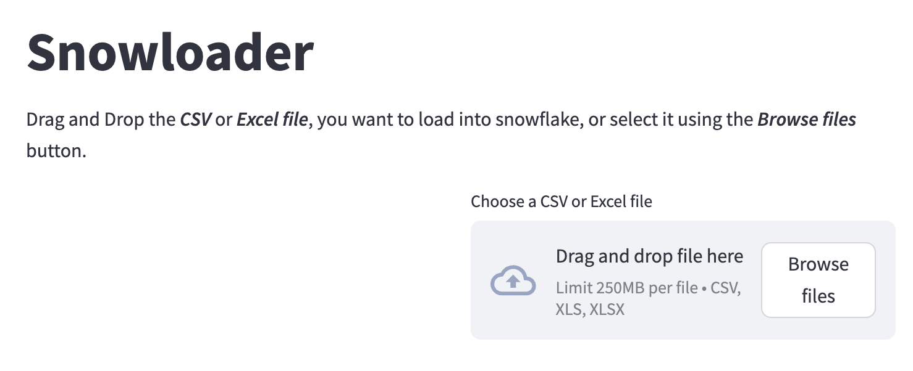

# Snowloader_app

Snowloader_app is a Python application that allows you to load CSV or Excel files into Snowflake.

## Installation

To install the required dependencies, run the following command:

pip install -r requirements.txt

## Configuration

The Snowflake connection details can be configured in the `snowflake_config.ini` file. Make sure to update the following values:

- Account: Your Snowflake account ID.
- User: Your Snowflake username.
- Role: Your Snowflake role.
- Warehouse: Your Snowflake warehouse.
- Database: Your Snowflake database.
- Schema: Your Snowflake schema.

## Usage

1. Drag and drop the CSV or Excel file you want to load into Snowflake, or select it using the "Browse files" button.
2. Fill in the Snowflake connection details.
3. Click the "Save" button to save the connection details.
4. Choose a CSV or Excel file to upload.
5. Enter a table name and click the "Upload to Snowflake" button.

## License

This project is licensed under the MIT License - see the [LICENSE.md](LICENSE.md) file for details.
